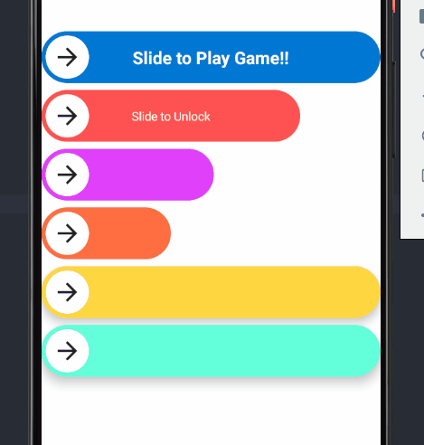

# SlideTodo

[](https://jitpack.io/#Nthily/SlideTodo)

A simple 'Slide to Unlock' **Material** widget for **Android**, written in **Jetpack Compose**

you can find source code [here](https://github.com/Nthily/SlideTodo/blob/main/slidetodo/src/main/java/com/github/nthily/slidetodo/SlideTodo.kt)

## Getting Started

```
allprojects {
  repositories {
    ...
    maven { url 'https://jitpack.io' }
  }
}
```

``` 
dependencies {
    implementation 'com.github.Nthily:SlideTodo:1.2.0'
}
```

``` kotlin
@ExperimentalAnimationApi
@ExperimentalMaterialApi
@Composable
fun SlideTodo(
    slideHeight: Dp = 60.dp,
    slideWidth: Dp = 400.dp,
    slideColor: Color,
    navigationIcon: @Composable () -> Unit,
    navigationIconPadding: Dp = 0.dp,
    endIcon: @Composable () -> Unit,
    widthAnimationMillis: Int = 1000,
    text: String? = null,
    textStyle: androidx.compose.ui.text.TextStyle? = null,
    elevation: Dp = 0.dp
)
```




